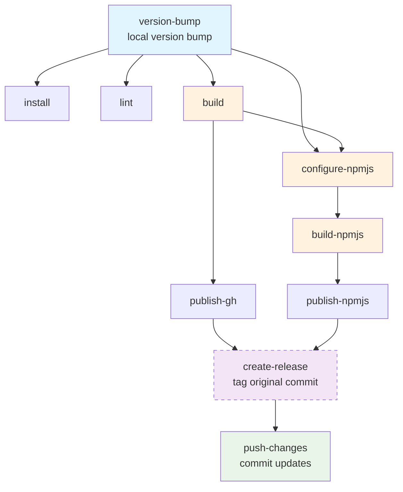
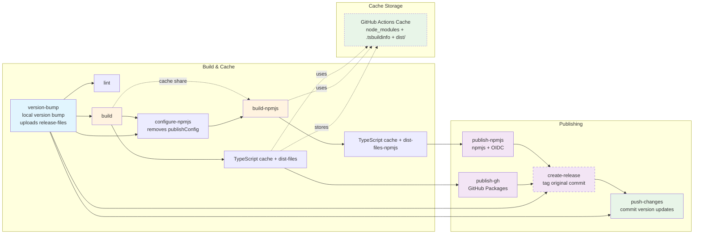

# Release Workflow

Publishes Sapatos to GitHub Packages and npmjs with OIDC authentication.

## Workflow Flow

## Job Dependencies

- `version-bump` → `lint`, `build`, `configure-npmjs`
- `build` → `configure-npmjs` → `build-npmjs`
- `lint` and `build` → `publish-gh` (must pass for publishing)
- `build-npmjs` → `publish-npmjs` (npmjs)
- `publish-gh`, `publish-npmjs`, `version-bump` → `create-release` (tag original commit)
- `create-release` → `push-changes` (commit version updates)

### Parallel Execution
- `lint` runs parallel with build and configure-npmjs
- `publish-gh` waits for both lint and build to pass
- `publish-gh` runs parallel with npmjs build chain
- TypeScript cache shared between builds

## Artifact Flow

## Usage

**Actions** → **Manual Release** → Select release type → **Run workflow**

Optional dry run mode available.
